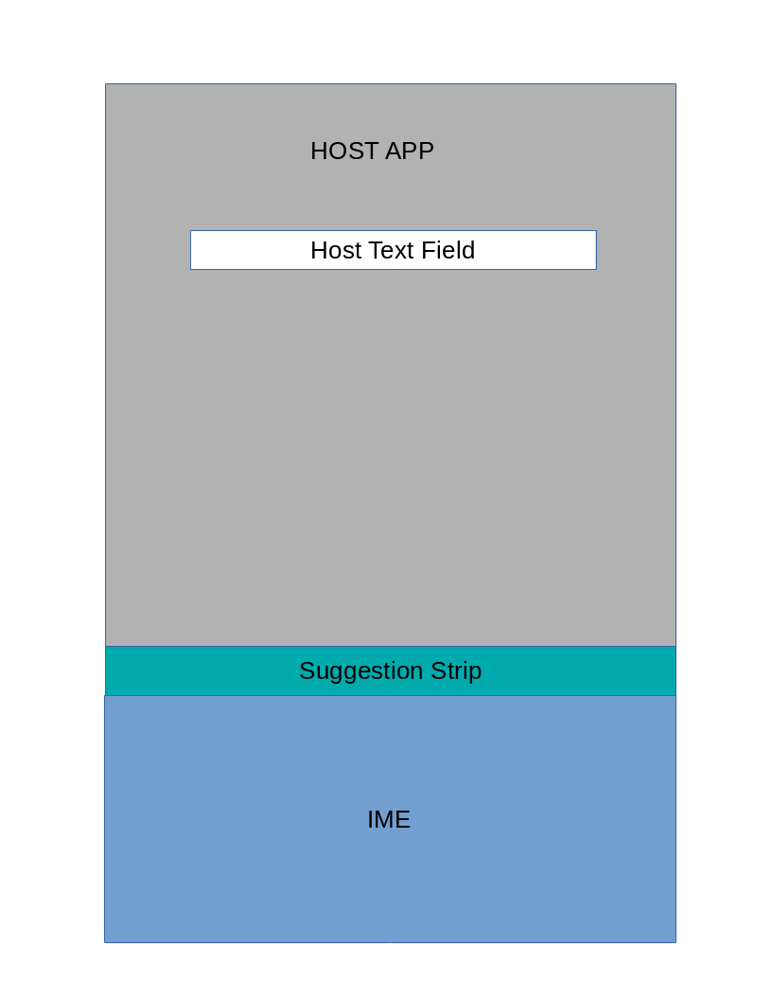
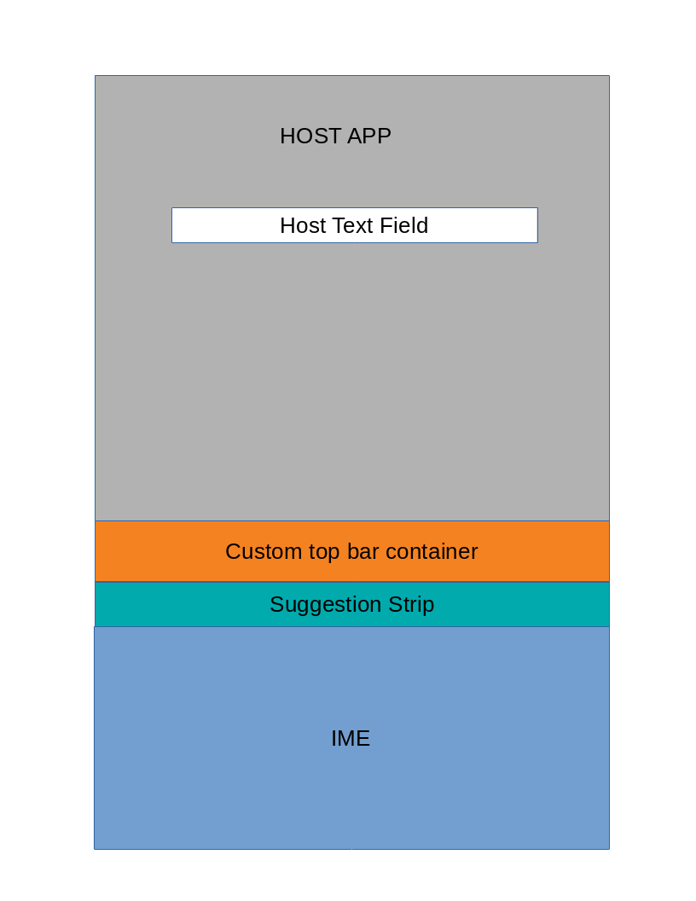
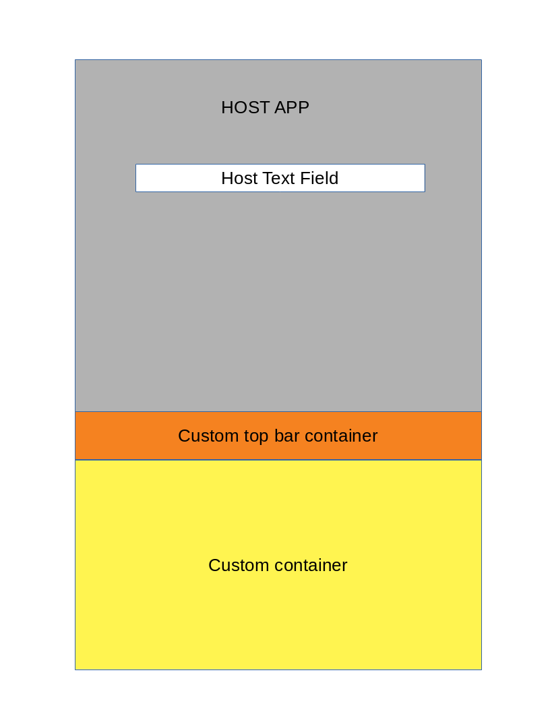
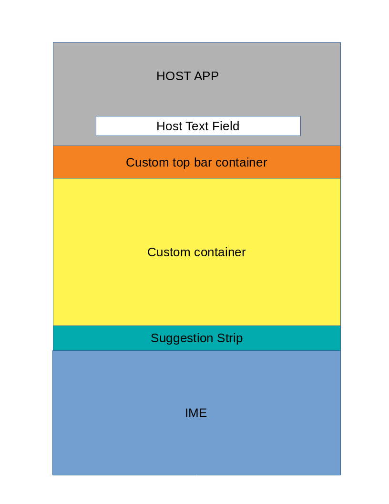
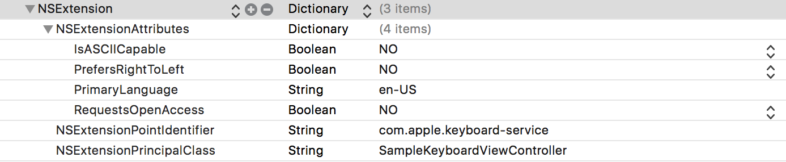

# Bobble IOS Keyboard SDK

## Overview
BobbleiOSKeyboard sdk provides complete solution to custom keyboard implementation on iOS. BobbleiOSKeyboard provides
following core IME features :

1. Word Suggestion
2. Word Prediction
3. Auto correct
4. English and Arabic language

This SDK exposes API endpoints to allow certain level of customization of IME.

## How to create custom keyboard

Import **BobbleKeyboardSDK.framework** to your iOS keyboard extension target. Create a custom class which extends 
**BobbleKeyboardViewController**, this class will act as the input view controller.

BobbleKeyboardSDK exposes two place holders which can contain customized view's and functionality, which are
1. Top Bar
2. Custom View

Below is the list of all UI configuration that is possible as part of customization.

Configuration | Description
------------- | -------------
 | IME is opened on a input view that supports word suggestion
 | IME is opened on a input view that supports word suggestion and custom top bar is made visible
 | IME is opened on a input view and both top bar and custom view is visible
 | IME is opened on a custom input view which supports word suggestion and both top bar and custom view is visible

When you are creating a custom keyboard extension, please make sure you have added following in Info.plist



BobbleKeyboardSDK provides following API endpoints:

#### 1. API viewWillAppear(animated)

The custom class that extends BobbleKeyboardViewController, need to override viewWillAppear(animated). viewWillAppear() is called when the keyboard service is triggered by system and before it gets visible to user. This is the starting point for view customization and all customization API calls must start from here.

**Example :**

```swift
import BobbleKeyboardSDK

class SampleKeyboardViewController: BobbleKeyboardViewController {

    override func viewWillAppear(_ animated: Bool) {
        // Add Customization API calls here
        super.viewWillAppear(animated)
    }

}
```

#### 2. API viewWillDisappear(animated)

The custom class that extends BobbleKeyboardViewController, may override viewWillDisappear(animated). viewWillDisappear() is called when keyboard service is triggered by system and its about to hide itself.

**Example :**

```swift
import BobbleKeyboardSDK

class SampleKeyboardViewController: BobbleKeyboardViewController {

    override func viewWillDisappear(_ animated: Bool) {
        // Add Customization API calls here
        super.viewWillDisappear(animated)
    }

}
```

#### 3. API showTopBar(UIView)

The custom class that extends BobbleKeyboardViewController can call showTopBar(UIView) API to show custom View in
keyboard's top bar place holder.

**Example :**

```swift
import UIKit
import BobbleKeyboardSDK

class SampleKeyboardViewController: BobbleKeyboardViewController {

    override func viewWillAppear(_ animated: Bool) {
        super.viewWillAppear(animated)
        
        // Build custom view that need to be shown in the tob bar container
        let topBarView:UIView = prepareTopBar()
        setTopBar(topBarView)
    }
    
    func prepareTopBar() -> UIView {
        // Place code here to generate custom view that need to be shown in the top bar
    }
}
```

#### 4. API showCustomView(View)

The custom class that extends BobbleKeyboardViewController can call showCustomView(View) API to show a custom view
in the custom view container. When showCustomView(View) is called, the keyboard input view is
closed and the custom view is shown. If already a custom view is visible, it is replaced by the
newly provided custom view.

**Example :**

```swift
import UIKit
import BobbleKeyboardSDK

class SampleKeyboardViewController: BobbleKeyboardViewController {
    
    override func viewWillAppear(_ animated: Bool) {
        super.viewWillAppear(animated)
        
        // Build custom view that need to be shown in the tob bar container
        let topBarView:UIView = prepareTopBar()
        setTopBar(topBarView)
    }
    
    func prepareTopBar() -> UIView {
        // Place code here to generate custom view that need to be shown in the top bar
        
        // Example of a button in top bar that's going to show custom view on click
        let topBarButton:UIButton = UIButton()
        topBarButton.addTarget(self, action: #selector(SampleKeyboardViewController.topBarButtonClicked(sender:)), for:     UIControlEvents.touchUpInside)
    }
    
    func topBarButtonClicked(sender: UIButton) {
        // Prepare the custom view
        let customView:UIView = prepareCustomView()
        // Call API to show the custom view and hide the keyboard input view
        showCustomView(view: customView);
    }
    
    func prepareCustomView() -> UIView {
        // Place code here to generate custom view that need to be shown in the top bar
    }
}
```

#### 5. API showKeyboardView()

The custom class that extends BobbleKeyboardViewController can call showKeyboardView() API to show keyboard input view
in case it was hidden due to previous call to showCustomView(View) and custom view was visible.
Calling showKeyboardView() will close visible custom view (if any) and will show keyboard input view.

**Example :**

```swift
import UIKit
import BobbleKeyboardSDK

class SampleKeyboardViewController: BobbleKeyboardViewController {
    override func viewWillAppear(_ animated: Bool) {
        super.viewWillAppear(animated)
        
        // Build custom view that need to be shown in the tob bar container
        let topBarView:UIView = prepareTopBar()
        setTopBar(topBarView)
    }
    
    func prepareTopBar() -> UIView {
        // Place code here to generate custom view that need to be shown in the top bar
        
        // Example of a button in top bar that's going to show custom view on click
        let topBarButton:UIButton = UIButton()
        topBarButton.addTarget(self, action: #selector(SampleKeyboardViewController.topBarButtonClicked(sender:)), for:     UIControlEvents.touchUpInside)
        
        // Example of a button in top bar that's going to show keyboard view on click                
        let topBarCloseButton:UIButton = UIButton()
        topBarCloseButton.addTarget(self, action: #selector(SampleKeyboardViewController.topBarCloseButtonClicked(sender:)), for: UIControlEvents.touchUpInside)

    }
    
    func topBarButtonClicked(sender: UIButton) {
        // Prepare the custom view
        let customView:UIView = prepareCustomView()
        // Call API to show the custom view and hide the keyboard input view
        showCustomView(view: customView);
    }
    
    func topBarCloseButtonClicked(sender: UIButton) {
        // Call API to show keyboard input view and hide the custom view
        showKeyboardView();
    }
    
    func prepareCustomView() -> UIView {
        // Place code here to generate custom view that need to be shown in the top bar
    }
}
```

#### 6. API setInputTarget(TextInputView)

The custom class that extends BobbleKeyboardViewController can call setInputTarget(TextInputView) API to set input method interaction target programmatically. The input target that is passed as argument to this API must extend TextInputView and its visible in any custom view container (top bar or main custom view) previously.

**Example :**

```swift
import UIKit
import BobbleKeyboardSDK

class SampleKeyboardViewController: BobbleKeyboardViewController {
    override func viewWillAppear(_ animated: Bool) {
        super.viewWillAppear(animated)
        
        // Build custom view that need to be shown in the tob bar container
        let topBarView:UIView = prepareTopBar()
        setTopBar(topBarView)
    }
    
    func prepareTopBar() -> UIView {
        // Place code here to generate custom view that need to be shown in the top bar
        
        // Example of a button in top bar that's going to show custom view on click
        let topBarButton:UIButton = UIButton()
        topBarButton.addTarget(self, action: #selector(SampleKeyboardViewController.topBarButtonClicked(sender:)), for:     UIControlEvents.touchUpInside)
    }
    
    func topBarButtonClicked(sender: UIButton) {
        // Prepare the custom view
        let customView:UIView = prepareCustomView()

        // Create a edit text and add inside the custom view
        let textInputView = TextInputView()
        customView.addSubView(textInputView)

        // Call API to show the custom view and hide the keyboard input view
        showCustomView(view: customView);

        setInputTarget(textInputView)

    }
    
    func prepareCustomView() -> UIView {
        // Place code here to generate custom view that need to be shown in the top bar
        
    }
}
```

#### 7. API restoreInputTarget()

The custom class that extends BobbleKeyboardViewController can call restoreInputTarget() API to restore input transaction back to host app. If a custom view was visible previously and also keyboard input view was visible, then only custom view is shown and keyboard input view is closed. After this API is called, any input interaction will be performed on the host app until and unless user does not manually focuses to a text field inside custom view.

**Example :**

```swift
import UIKit
import BobbleKeyboardSDK

class SampleKeyboardViewController: BobbleKeyboardViewController {
    override func viewWillAppear(_ animated: Bool) {
        super.viewWillAppear(animated)
        
        // Build custom view that need to be shown in the tob bar container
        let topBarView:UIView = prepareTopBar()
        setTopBar(topBarView)
    }
    
    func prepareTopBar() -> UIView {
        // Place code here to generate custom view that need to be shown in the top bar
        
        // Example of a button in top bar that's going to show custom view on click
        let topBarButton:UIButton = UIButton()
        topBarButton.addTarget(self, action: #selector(SampleKeyboardViewController.topBarButtonClicked(sender:)), for:     UIControlEvents.touchUpInside)

        // Example of a button in top bar that's going to show keyboard view on click                
        let topBarCloseButton:UIButton = UIButton()
        topBarCloseButton.addTarget(self, action: #selector(SampleKeyboardViewController.topBarCloseButtonClicked(sender:)), for: UIControlEvents.touchUpInside)
    }
    
    func topBarButtonClicked(sender: UIButton) {
        // Prepare the custom view
        let customView:UIView = prepareCustomView()

        // Create a edit text and add inside the custom view
        let textInputView = TextInputView()
        customView.addSubView(textInputView)

        // Call API to show the custom view and hide the keyboard input view
        showCustomView(view: customView);

        setInputTarget(textInputView)

    }
    
    func topBarCloseButtonClicked(sender: UIButton) {
        // Call API to restore the input transaction back to host app 
        restoreInputTarget()

        // Call API to show keyboard input view and hide the custom view
        showKeyboardView();
    }

    func prepareCustomView() -> UIView {
        // Place code here to generate custom view that need to be shown in the top bar
        
    }
}
```

#### 8. API setKeyboardLanguage(language)

The custom class that extends BobbleKeyboardViewController can call setKeyboardLanguage() API to set the language of the keyboard. 
language could take string values "ar" or "en".

**Example :**

```swift
import UIKit
import BobbleKeyboardSDK

class SampleKeyboardViewController: BobbleKeyboardViewController {
    override func viewWillAppear(_ animated: Bool) {
        super.viewWillAppear(animated)
        
        // Build custom view that need to be shown in the tob bar container
        let topBarView:UIView = prepareTopBar()
        setTopBar(topBarView)
    }
    
    func prepareTopBar() -> UIView {
        // Place code here to generate custom view that need to be shown in the top bar
        
        // Example of a button in top bar that's going to show custom view on click
        let topBarButton:UIButton = UIButton()
        topBarButton.addTarget(self, action: #selector(SampleKeyboardViewController.topBarButtonClicked(sender:)), for:     UIControlEvents.touchUpInside)
    }
    
    func topBarButtonClicked(sender: UIButton) {
        setKeyboardLanguage("ar")
    }
}
```

#### 9. API setIMESettings(key:NSInteger , value:Bool)

The custom class that extends BobbleKeyboardViewController can call changeUserKeyboardSetting() API to change keyboard's settings programmatically.
Here are the possible values of key parameter: WORD_SUGGESTION,AUTO_CORRECTION, AUTO_CAPITALIZATION, LOWERCASE_KEY_CAPS, KEYPAD_CLICK_SOUND.

**Example :**

```swift
import UIKit
import BobbleKeyboardSDK

class SampleKeyboardViewController: BobbleKeyboardViewController {
    override func viewWillAppear(_ animated: Bool) {
        super.viewWillAppear(animated)
        
        // Build custom view that need to be shown in the tob bar container
        let topBarView:UIView = prepareTopBar()
        setTopBar(topBarView)
    }
    
    func prepareTopBar() -> UIView {
        // Place code here to generate custom view that need to be shown in the top bar
        
        // Example of a button in top bar that's going to show custom view on click
        let topBarButton:UIButton = UIButton()
        topBarButton.addTarget(self, action: #selector(SampleKeyboardViewController.topBarButtonClicked(sender:)), for:     UIControlEvents.touchUpInside)
    }
    
    func topBarButtonClicked(sender: UIButton) {
        changeUserKeyboardSetting(SETTING_AUTO_CAPITALIZATION, false)
    }
}
```
#### 10. API showTopBar()

The custom class that extends BobbleKeyboardViewController can call showTopBar() API to control the visibility of the top bar.

**Example :**
     
```swift
import UIKit
import BobbleKeyboardSDK

class SampleKeyboardViewController: BobbleKeyboardViewController {
    override func viewWillAppear(_ animated: Bool) {
        super.viewWillAppear(animated)
        
        // Build custom view that need to be shown in the tob bar container
        let topBarView:UIView = prepareTopBar()
        setTopBar(topBarView)
        showTopBar()
    }
    
    func prepareTopBar() -> UIView {
        // Place code here to generate custom view that need to be shown in the top bar
        
        // Example of a button in top bar that's going to show custom view on click
        let topBarButton:UIButton = UIButton()
        topBarButton.addTarget(self, action: #selector(SampleKeyboardViewController.topBarButtonClicked(sender:)), for:     UIControlEvents.touchUpInside)
    }   
}
```     
     
#### 11. API hideTopBar()

The custom class that extends BobbleKeyboardViewController can call hideTopBar() API to hide the visibility of the top bar.

**Example :**
     
```swift
import UIKit
import BobbleKeyboardSDK

class SampleKeyboardViewController: BobbleKeyboardViewController {
    override func viewWillAppear(_ animated: Bool) {
        super.viewWillAppear(animated)
        
        // Build custom view that need to be shown in the tob bar container
        let topBarView:UIView = prepareTopBar()
        setTopBar(topBarView)
        hideTopBar()
    }
    
    func prepareTopBar() -> UIView {
        // Place code here to generate custom view that need to be shown in the top bar
        
        // Example of a button in top bar that's going to show custom view on click
        let topBarButton:UIButton = UIButton()
        topBarButton.addTarget(self, action: #selector(SampleKeyboardViewController.topBarButtonClicked(sender:)), for:     UIControlEvents.touchUpInside)
    }
}
```

#### 12. API showOverlay(view: UIView)

The custom class that extends BobbleKeyboardViewController can call showOverlay() API to render the passed along view ontop of the visible keyboard area.This view should allow for transparency so that the keyboard beneath may be visible
     
**Example :**
     
```swift
import UIKit
import BobbleKeyboardSDK

class SampleKeyboardViewController: BobbleKeyboardViewController {
    override func viewWillAppear(_ animated: Bool) {
        super.viewWillAppear(animated)
        
        // Build custom view that need to be shown in the tob bar container
        let overlay = UIView()
        overlat.backgroundColor = UIColor.orange
        overlat.alpha = 0.5
        showOverlay(view: overlay)
    }
}
```

#### 13. API hideOverlay()

The custom class that extends BobbleKeyboardViewController can call hideOverlay() API to hide the overlay view.
     
**Example :**

```swift
import UIKit
import BobbleKeyboardSDK

class SampleKeyboardViewController: BobbleKeyboardViewController {
    override func viewWillAppear(_ animated: Bool) {
        super.viewWillAppear(animated)
        
        // Build custom view that need to be shown in the tob bar container
        hideOverlay()
    }
}
```

#### 14. API loadSuggestionView()

The custom class that extends BobbleKeyboardViewController can call loadSuggestionView() API to load the passed in view onto the suggestion bar.
     
**Example :**

```swift
import UIKit
import BobbleKeyboardSDK

class SampleKeyboardViewController: BobbleKeyboardViewController {
    override func viewWillAppear(_ animated: Bool) {
        super.viewWillAppear(animated)
        
        // Build custom view that need to be shown in the tob bar container
        //width : flexible
        //height : equalt to Suggestion Bar
         let suggestionV = UIView(frame: CGRect(x: 45, y: 0, width: , height: ))
           loadSuggestionView(view: suggestionV)
    }
}
```
#### 15. API onWordCommit()

Client needs to set this delegate to recieve input word after space and '.'. It also needs to implement required onWordCommit(string: String) method.
      
**Example :**     

```swift
      
import UIKit
import BobbleKeyboardSDK

class SampleKeyboardViewController: BobbleKeyboardViewController, BobbleWordCommitDelegate {
    
    func onWordCommit(string: String) {
         print("callBackString:",string)
    }
    
    override func viewDidAppear(_ animated: Bool) {
        super.viewWillAppear(animated)
        
        //inherit BobbleCallBack delegate
        //implement onWordCommit func
        //set delegate for onCommit callBack
        setBobbleWordCommitDelegate(delegate: self)
        
    }
  }  
  ```
      
#### 16. API loadTheme(themeObject:KeyboardThemeModel?)
  
The custom class that extends BobbleKeyboardViewController can call loadTheme() to customize the keyboard UI.

Here are the parameters supported by KeyboardThemeModel. Please note all color values must be hex values.

1. keyboardBackgroundColor:String(pass the hex color string code)
2. keyColor:String(pass the hex color string code)
3. suggestionBarColor:String(pass the hex color string code)
4. suggestionDividerColor:String(pass the hex color string code) 
5. suggestionTextColor:String(pass the hex color string code)
6. keyTextcolor:String(pass the hex color string code)
7. keyBorderColor:String(pass the hex color string code)
8. keyUnderLinecolor:String(pass the hex color string code)
9. isThemeDarkType:Bool (true for dark theme and false for light theme)

To set the default theme, please pass parameter as nil.
     
**Example :**
  
```swift

import UIKit
import BobbleKeyboardSDK

class SampleKeyboardViewController: BobbleKeyboardViewController {
    
    override func viewDidAppear(_ animated: Bool) {
        super.viewWillAppear(animated)
        
        //Customized theme
     
        let themeObject:KeyboardThemeModel = KeyboardThemeModel(keyboardBackgroundColor: "#f4b642", keyColor: "#f44d41",               suggestionBarColor: "#f441f1", suggestionDividerColor: "#85f441", suggestionTextColor: "#4194f4", keyTextcolor:               "843sdf", keyBorderColor: "#85fdsa", keyUnderLinecolor: "#54850s", isThemeDarkType: true)
        
        loadTheme(themeObject: themeObject)
        
         //Default theme
        loadTheme(themeObject: nil)
   }
 }  
 ```
 #### 17.KeyboardMode

Default 0(Alphabets),1(numeric),2(symbols)
Email - 3(Alphabets),4(numeric),5(symbols)
Url - 6(Alphabets),7(numeric),8(symbols)
continue arrow- 10(Alphabets),11(numeric),12(symbols)
Arrow + email -13(Alphabets), 14(numeric),15(symbols)
Arrow + url - 16(Alphabets),17(numeric),18(symbols)
Blue arrow - 20(Alphabets),21,22(symbols)
Blue arrow + email -23(Alphabets),24(numeric),25(symbols)
Blue arrow + Url - 26(Alphabets),27(numeric),28(symbols)
Search - 30(Alphabets),31(numeric),32(symbols)
Search + email -33(Alphabets),34(numeric),35(symbols)

 
 #### 18. Word Suggestion and Prediction delegates
 
These delegates allow to show third-party suggestions and predictions and in turn allow to have your own algorithm implementation. If in case third party couldn't find any suggestions and predictions, default suggestions and predictions will come.
  
To use this feature, first you need to add and set delegate in viewController 
  **Example :**
  
```swift

import UIKit
import BobbleKeyboardSDK
 
class SampleKeyboardViewController: BobbleKeyboardViewController, WordSuggestionDelegate {
 
    func bobbleKeyboard(_ bobbleKeyboard: BLKeyboardViewController, nextWordsfor word: String, previousWord: String) ->               (wordSuggestion: [String], autocurrect: ObjCBool) {
       return (["king","queen","happy"], true)
    }
    
    func bobbleKeyboard(_ bobbleKeyboard: BLKeyboardViewController, wordPridictionfor word: String, previousWord: String) ->           [String] {
       return  ["not","seen","yet"]
    }
 }  
 ```
 
 #### 19. Improve Auto-Correction by Threshold value
 
This API allows client to change auto-correct threshold value at runtime.
 
**Example :**
  
```swift

import UIKit
import BobbleKeyboardSDK

class SampleKeyboardViewController: BobbleKeyboardViewController {
 
    override func viewWillAppear(_ animated: Bool) {
        super.viewWillAppear(animated)
        setThresholdValueForAutoCorrection(value: 0.15)
    }
 }
 ```
