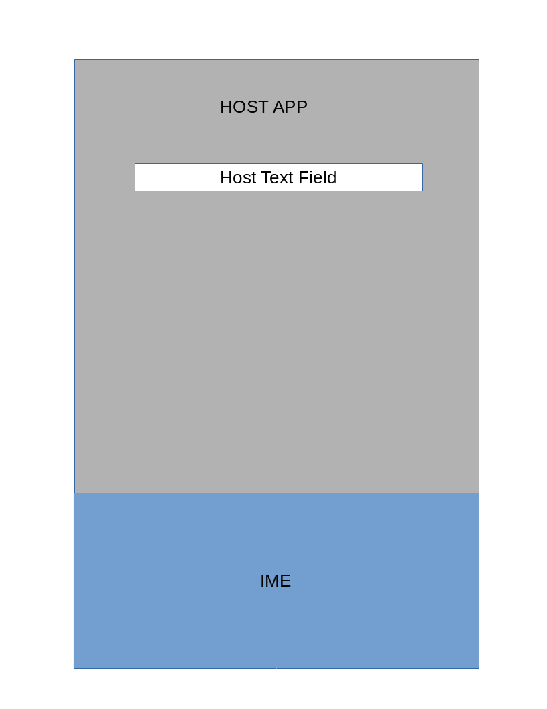
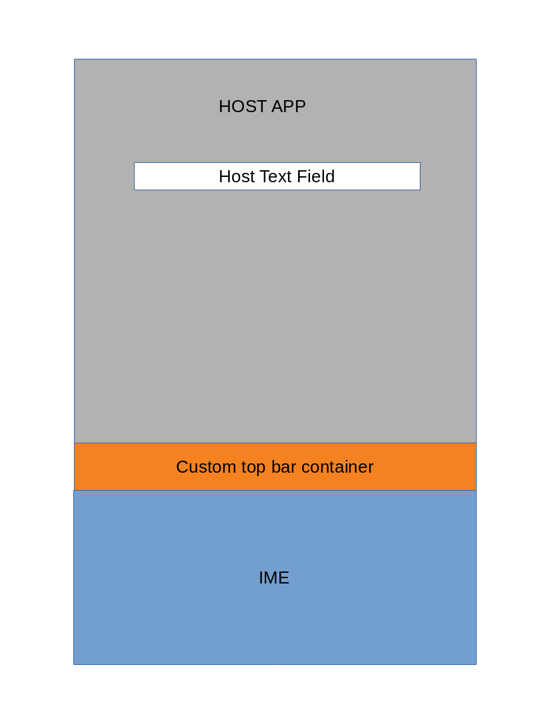
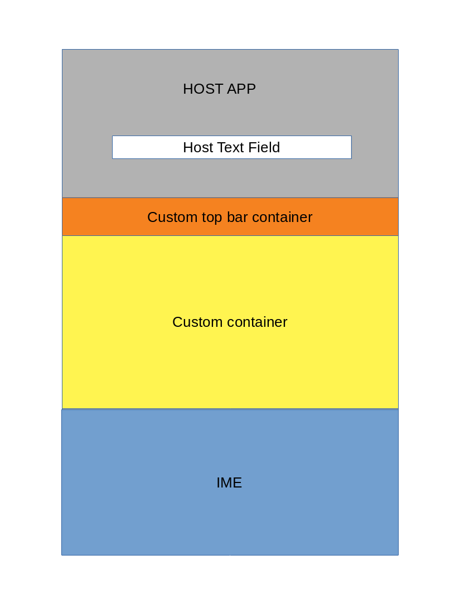

# BobbleIME SDK

## Overview
BobbleIME sdk provides complete solution to Input Method Editor implementation. BobbleIME provides
following core IME features :

1. Word Suggestion
2. Word Prediction
3. Gesture typing of Latin scripts
4. Auto correct
5. English and Arabic language
6. Customizable language dictionary

This SDK exposes API endpoints to allow certain level of customization of IME.

## How to create custom IME

Import **BobbleIME.aar** as submodule to your android project. Create a custom class which extends 
BobbleIME, this class will act as the input method service. 


BobbleIME exposes two place holders which can contain customized view's and functionality, which are
1. Top Bar
2. Custom View

Below is the list of all UI configuration that is possible as part of customization.

Configuration | Description
------------- | -------------
 | IME is opened on a input view that does not supports word suggestion
 | IME is opened on a input view that supports word suggestion
 | IME is opened on a input view that does not supports word suggestion and custom top bar is made visible
 | IME is opened on a input view that supports word suggestion and custom top bar is made visible
 | IME is opened on a input view and both top bar and custom view is visible
 | IME is opened on a custom input view which does not supports word suggestion and both top bar and custom view is visible
 | IME is opened on a custom input view which supports word suggestion and both top bar and custom view is visible


You also need to register your custom IME class in manifest as InputMethod service.

**Example :**

```xml
<service
    android:name=".CustomIME"
    android:label="MyCustomIME"
    android:permission="android.permission.BIND_INPUT_METHOD">
    <intent-filter>
        <action android:name="android.view.InputMethod" />
    </intent-filter>
</service>
```

BobbleIME provides following API endpoints:

#### 1. API onStartIME()

The custom class that extends BobbleIME, need to override onStartIME(). onStartIME() is called
when the IME is triggered by system and its visible to user. This is the starting point for IME
customization and all customization API calls must start from here.

**Example :**

```java
import com.android.inputmethod.latin.BobbleIME;

class CustomIME extends BobbleIME {
    @Override
    public void onStartIME() {
        
        // Add Customization API calls here
        
        super.onStartIME();
    }
}
```

#### 2. API onFinishIME()

The custom class that extends BobbleIME, may override onFinishIME(). onFinishIME() is called when
IME service is triggered by system and its about to hide itself.

**Example :**

```java
import com.android.inputmethod.latin.BobbleIME;

class CustomIME extends BobbleIME {
    @Override
    public void onFinishIME() {
        
        // Add custom cleanup calls on IME close (if needed)
        
        super.onFinishIME();
    }
}
```

#### 3. API showTopBar(View)

The custom class that extends BobbleIME can call showTopBar(View) API to show custom View in
IME's top bar place holder.

**Example :**

```java
import com.android.inputmethod.latin.BobbleIME;
import android.view.View;

class CustomIME extends BobbleIME {
    @Override
    public void onStartIME() {
        // Build custom view that need to be shown in the tob bar container
        final View customTopBarView = prepareTopBar();
        
        // Attach the view to the top bar container
        setTopBar(customTopBarView);
        
        super.onStartIME();
    }
    
    private View prepareTopBar() {
        // Place code here to generate custom view that need to be shown in the top bar
    }
}
```

#### 4. API showCustomView(View)

The custom class that extends BobbleIME can call showCustomView(View) API to show a custom view
in the custom view container. When showCustomView(View) is called, the keyboard input view is
closed and the custom view is shown. If already a custom view is visible, it is replaced by the
newly provided custom view.

###### NOTE
> All text input targets in custom view must extend BobbleEditText so keyboard input can interact with it.

**Example :**

```java
import com.android.inputmethod.latin.BobbleIME;
import android.view.View;
import android.widget.Button;

class CustomIME extends BobbleIME {
    @Override
    public void onStartIME() {
        // Build custom view that need to be shown in the tob bar container
        final View customTopBarView = prepareTopBar();
        
        // Attach the view to the top bar container
        setTopBar(customTopBarView);
        
        super.onStartIME();
    }
    
    private View prepareTopBar() {
        // Place code here to generate custom view that need to be shown in the top bar
        
        // Example of a button in top bar that's going to show custom view on click
        Button topBarButton1 = ...;
        topBarButton1.setOnClickListener(new View.OnClickListener() {
            @Override
            public void onClick(View v) {
                // Prepare the custom view
                final View customView = prepareCustomView();
                
                // Call API to show the custom view and hide the keyboard input view
                setCustomView(customView);
            }
        });
    }
    
    private View prepareCustomView() {
        // Place code here to generate custom view that need to be shown in the custom view container
    }
}
```

#### 5. API showKeyboardView()

The custom class that extends BobbleIME can call showKeyboardView() API to show keyboard input view
in case it was hidden due to previous call to showCustomView(View) and custom view was visible.
Calling showKeyboardView() will close visible custom view (if any) and will show keyboard input view.

**Example :**

```java
import com.android.inputmethod.latin.BobbleIME;
import android.view.View;
import android.widget.Button;

class CustomIME extends BobbleIME {
    @Override
    public void onStartIME() {
        // Build custom view that need to be shown in the tob bar container
        final View customTopBarView = prepareTopBar();
        
        // Attach the view to the top bar container
        setTopBar(customTopBarView);
        
        super.onStartIME();
    }
    
    private View prepareTopBar() {
        // Place code here to generate custom view that need to be shown in the top bar
        
        // Example of a button in top bar that's going to show custom view on click
        Button topBarButton1 = ...;
        topBarButton1.setOnClickListener(new View.OnClickListener() {
            @Override
            public void onClick(View v) {
                // Prepare the custom view
                final View customView = prepareCustomView();
                
                // Call API to show the custom view and hide the keyboard input view
                setCustomView(customView);
            }
        });
        
        // Example of a button in top bar that's going to close custom view and show keyboard input view
        Button topBarButton2 = ...;
        topBarButton2.setOnClickListener(new View.OnClickListener() {
            @Override
            public void onClick(View v) {
                // Call API to show keyboard input view and hide the custom view
                showKeyboardView();
            }
        });
    }
    
    private View prepareCustomView() {
        // Place code here to generate custom view that need to be shown in the custom view container
    }
}
```

#### 6. API setInputTarget(BobbleEditText)

The custom class that extends BobbleIME can call setInputTarget(BobbleEditText) API to set input method
interaction target programmatically. The input target that is passed as argument to this API must
extend BobbleEditText and its visible in any custom view container (top bar or main custom view) previously.

**Example :**

```java
import com.android.inputmethod.latin.BobbleIME;
import android.view.View;
import android.widget.Button;
import android.util.Pair;

class CustomIME extends BobbleIME {
    @Override
    public void onStartIME() {
        // Build custom view that need to be shown in the tob bar container
        final View customTopBarView = prepareTopBar();
        
        // Attach the view to the top bar container
        setTopBar(customTopBarView);
        
        super.onStartIME();
    }
    
    private View prepareTopBar() {
        // Place code here to generate custom view that need to be shown in the top bar
        
        // Example of a button in top bar that's going to show custom view on click
        Button topBarButton1 = ...;
        topBarButton1.setOnClickListener(new View.OnClickListener() {
            @Override
            public void onClick(View v) {
                // Prepare the custom view
                final Pair<View, BobbleEditText> customView = prepareCustomView();
                
                // Call API to show the custom view and hide the keyboard input view
                setCustomView(customView.first);
                
                // Call API to open keyboard input view which is attached to the edit text inside
                // custom view
                setInputTarget(customView.second);
            }
        });
    }
    
    private Pair<View, BobbleEditText> prepareCustomView() {
        // Place code here to generate custom view that need to be shown in the custom view container
        
        // Create a edit text and add inside the custom view
        BobbleEditText editText1 = ...;
    }
}
```

#### 7. API restoreInputTarget()

The custom class that extends BobbleIME can call restoreInputTarget() API to restore input transaction
back to host app. If a custom view was visible previously and also keyboard input view was visible,
then only custom view is shown and keyboard input view is closed. After this API is called, any input
interaction will be performed on the host app until and unless user does not manually focuses
to a text field inside custom view.

**Example :**

```java
import com.android.inputmethod.latin.BobbleIME;
import android.view.View;
import android.widget.Button;
import android.util.Pair;

class CustomIME extends BobbleIME {
    @Override
    public void onStartIME() {
        // Build custom view that need to be shown in the tob bar container
        final View customTopBarView = prepareTopBar();
        
        // Attach the view to the top bar container
        setTopBar(customTopBarView);
        
        super.onStartIME();
    }
    
    private View prepareTopBar() {
        // Place code here to generate custom view that need to be shown in the top bar
        
        // Example of a button in top bar that's going to show custom view on click
        Button topBarButton1 = ...;
        topBarButton1.setOnClickListener(new View.OnClickListener() {
            @Override
            public void onClick(View v) {
                // Prepare the custom view
                final Pair<View, BobbleEditText> customView = prepareCustomView();
                
                // Call API to show the custom view and hide the keyboard input view
                setCustomView(customView.first);
                
                // Call API to open keyboard input view which is attached to the edit text inside
                // custom view
                setInputTarget(customView.second);
            }
        });
        
        // Example of a button in top bar that closes the custom view and attaches the input transaction
        // back to host app
        Button topBarButton2 = ...;
        topBarButton2.setOnClickListener(new View.OnClickListener() {
            @Override
            public void onClick(View v) {
                // Call API to restore the input transaction back to host app 
                restoreInputTarget();
                
                // Call API to close the custom view
                showKeyboardView();
            }
        });
    }
    
    private Pair<View, BobbleEditText> prepareCustomView() {
        // Place code here to generate custom view that need to be shown in the custom view container
        
        // Create a edit text and add inside the custom view
        BobbleEditText editText1 = ...;
    }
}
```
